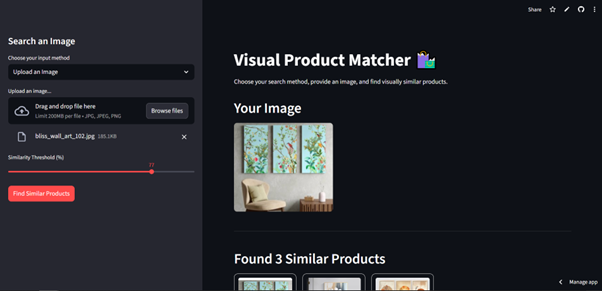

# 🛍️ Visual Product Matcher

A web application built with Python and Streamlit that allows users to find visually similar products by uploading an image or providing an image URL. This project was developed as a technical assessment for a Software Engineer position.

---

## 🚀 Live Application
You can access the live version here: **[Visual Product Matcher Demo](https://https://visualfinder0303.streamlit.app/)**



---

## ✨ Key Features

### Dual Image Input: 
Users can search for products using two methods:
- Direct file upload (.jpg, .png, .jpeg)
- Pasting an image URL

### Visual Similarity Search: 
The app uses an AI model (CLIP) to analyze the input image and find the most visually similar items from a product database.

### Dynamic Filtering: 
A similarity slider allows users to filter the results in real-time based on the match percentage.

### Responsive UI: 
The interface is fully responsive and works seamlessly on both desktop and mobile devices.

### Clean Product Grid: 
Results are displayed in a uniform, aesthetically pleasing grid that preserves image aspect ratios.

---

## 🧠 Brief Approach (Project Write-up)

The core of this application is a visual search engine powered by vector embeddings. The technical approach involves two main phases.

First, an offline processing step where every product image in the database is passed through a pre-trained AI model (CLIP `ViT-B-32`). The model converts each image into a high-dimensional numerical vector, or "embedding," which captures its visual features. These embeddings are stored for quick access.

Second, a real-time search phase. When a user uploads an image, it's converted into a vector using the same AI model. The application then calculates the **cosine similarity** between the user's image vector and every pre-calculated product vector. The resulting similarity scores represent the visual likeness between the images. Products are then sorted by this score, with the highest values representing the best visual matches. This method is highly efficient as the expensive embedding calculation for the database is only done once.

---
## 🛠️ Tech Stack & Architecture

This project is built entirely in Python, leveraging a simple and powerful stack for rapid AI application development.

- **Web Framework**: Streamlit - Used to build the entire interactive user interface with Python
- **AI / Machine Learning**: Sentence-Transformers (based on PyTorch) - For easy access to the pre-trained CLIP-ViT-B-32 model to generate vector embeddings
- **Data Handling**: Pandas & NumPy - For efficient loading, manipulation, and calculation of product data and similarity scores
- **Image Processing**: Pillow - Used for handling image uploads, resizing, and preserving aspect ratios
- **Deployment**: Streamlit Community Cloud - For free, seamless hosting directly from the GitHub repository

The core of the application relies on converting images to vector embeddings and then calculating the cosine similarity to find the closest matches.

---

## 📂 Project Structure

The repository is organized to be simple and easy to understand.

```
.
├── public/                # Contains all data and images
│   ├── product-images/    # Local product images
│   ├── products.json      # Original product data with web URLs
│   ├── products_local.json # Processed data with local image paths
│   └── product_embeddings.json # Pre-calculated vectors for each product
├── scripts/
│   ├── download_images.py      # (Utility) Script to download images from a JSON file
│   └── generate_embeddings.py # (Utility) Script to pre-calculate image embeddings
├── app.py                 # The main Streamlit application file
├── requirements.txt       # List of Python dependencies for deployment
├── .gitignore             # Specifies files for Git to ignore

```

---

## ⚙️ Setup and Running Locally

To run this project on your local machine, follow these steps:

### 1. Clone the Repository

```bash
git clone [your-repository-url]
cd visual-product-matcher
```

### 2. Create and Activate a Virtual Environment

```bash
# Create the environment
python -m venv venv

# Activate it (Windows)
venv\Scripts\activate

# Activate it (macOS/Linux)
source venv/bin/activate
```

### 3. Install Dependencies
All required libraries are listed in requirements.txt.

```bash
pip install -r requirements.txt
```

### 4. Run the Application

```bash
streamlit run app.py
```

Your browser will automatically open with the application running locally.

---